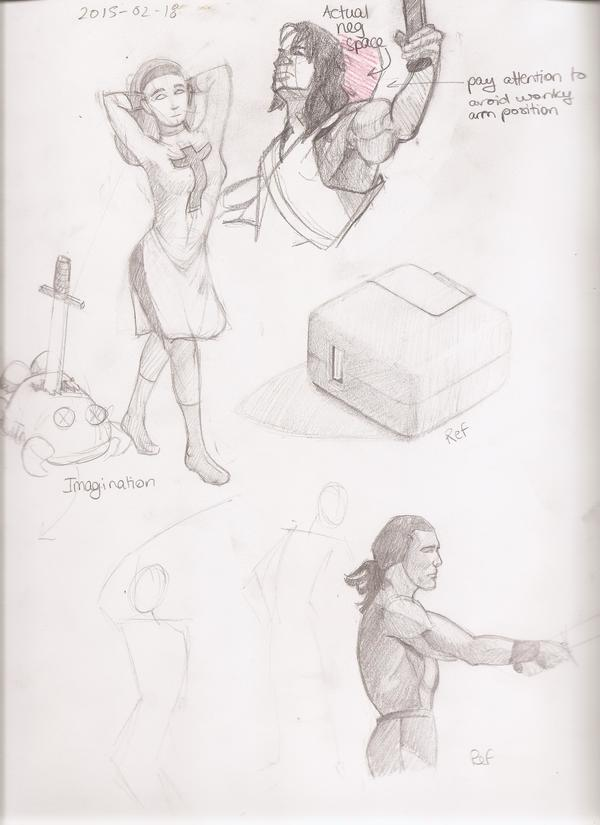
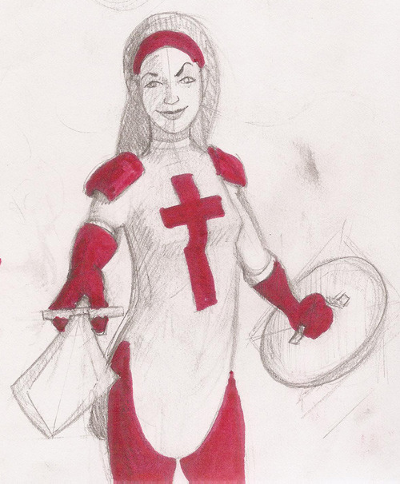

Drawing from imagination. I was getting comfortable with doing still lives, so it was time to challenge myself and draw from imagination. It was a good slap to the face so I&rsquo;ll try to always do 1 piece from imagination from now on and then study what I think I did worst at.

