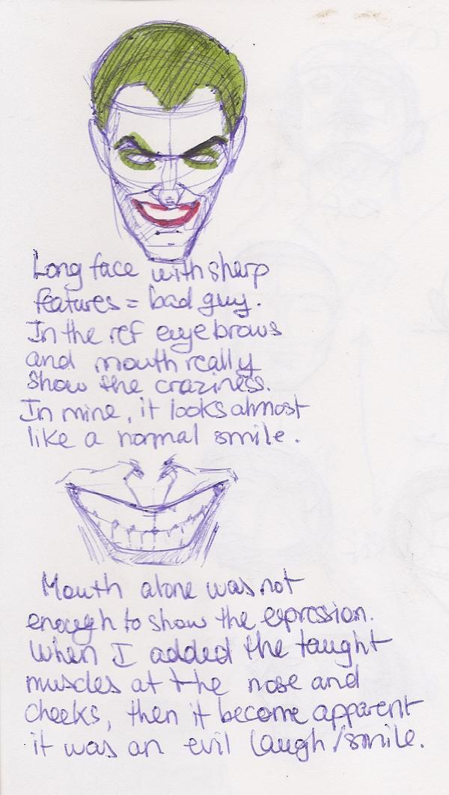
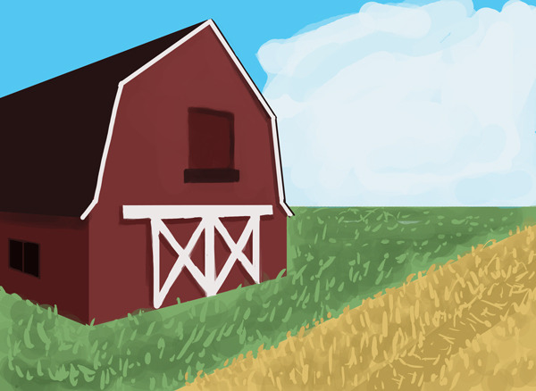
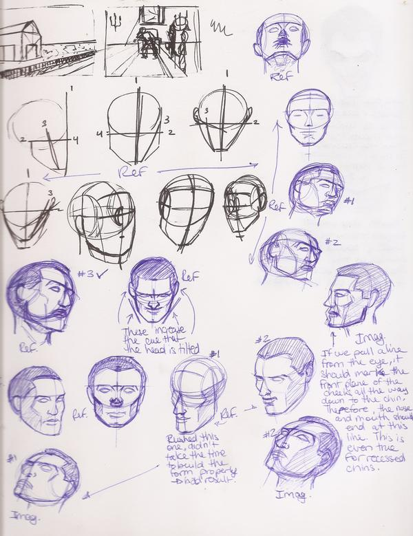

I really like how I studied the heads today. I really took it slow and I actually didn&rsquo;t draw that many of them, yet I feel like I learned much more in this short study compared to my &ldquo;draw 100 heads&rdquo; sessions because I took the time to analyze what I was doing and what I was trying to learn from each one of them.

