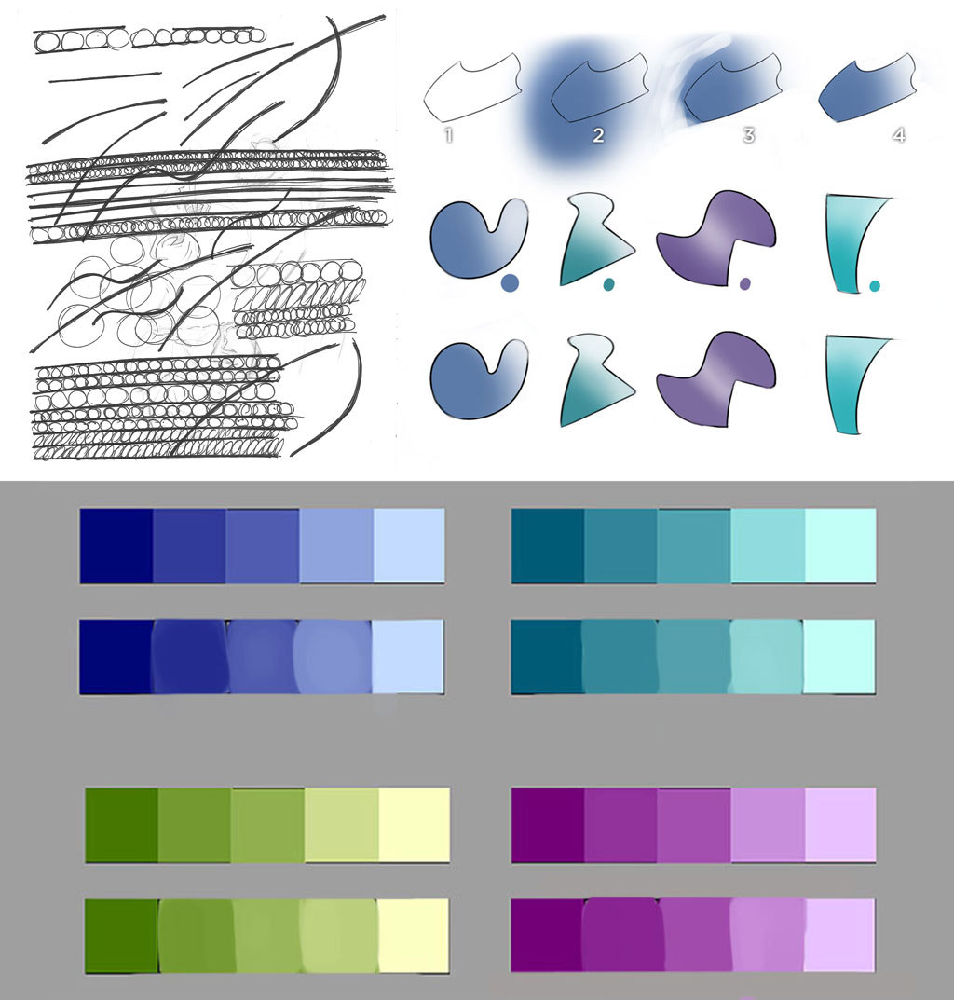

I’ve failed many times at making drawing a daily habit but I refuse to give up.

Some exercises from <a href="https://www.youtube.com/watch?v=wgDNDOKnArk">dynamic sketching by Peter Han</a> and <a href="http://www.ctrlpaint.com/library/">Digital Painting 101 by Ctrl+Paint</a>

