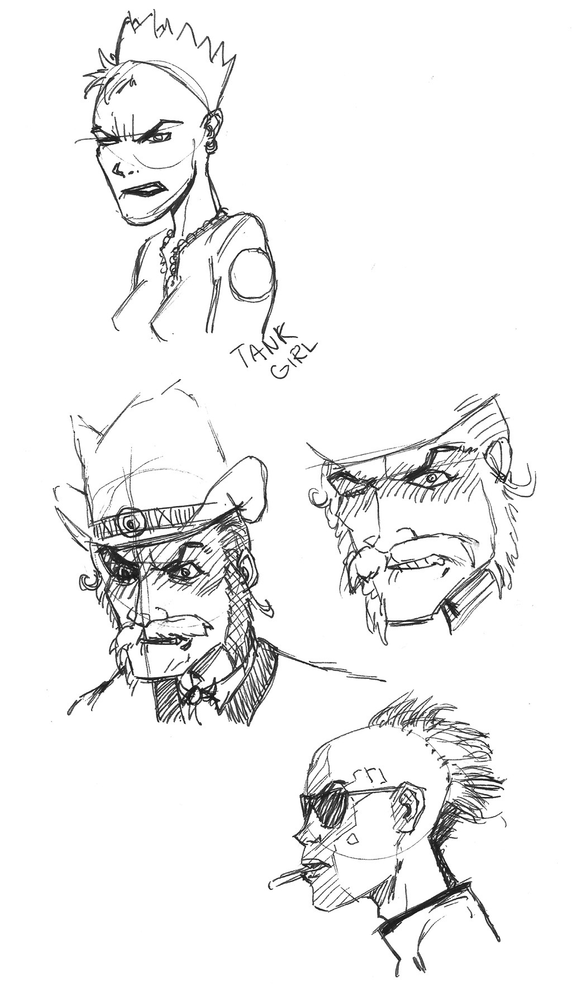
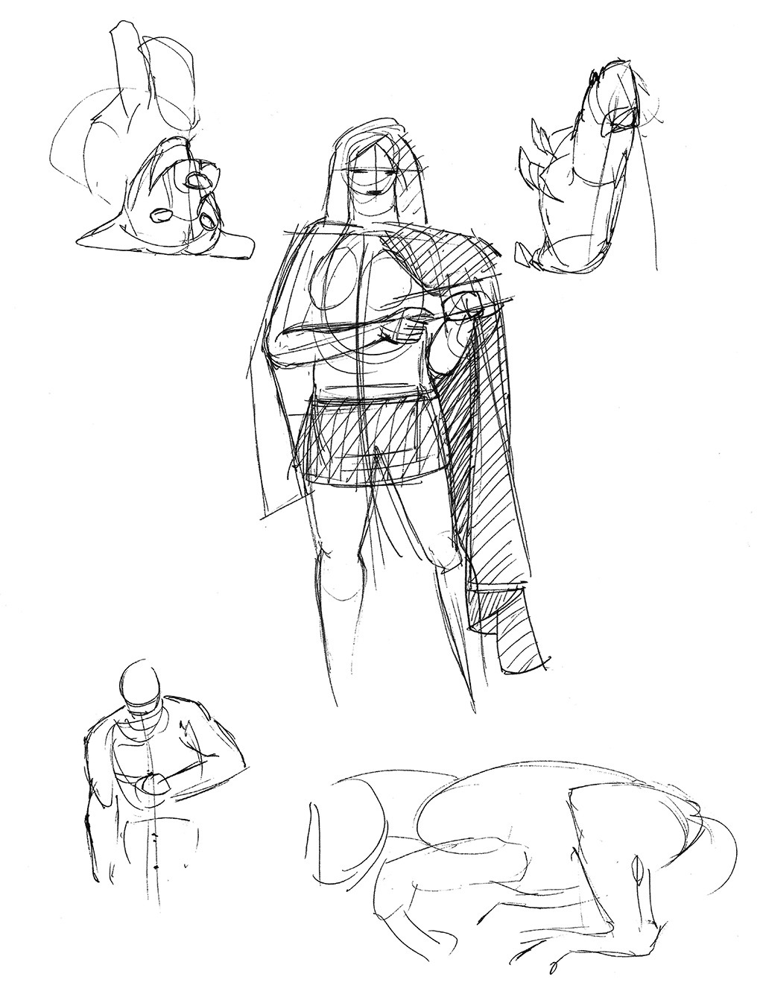
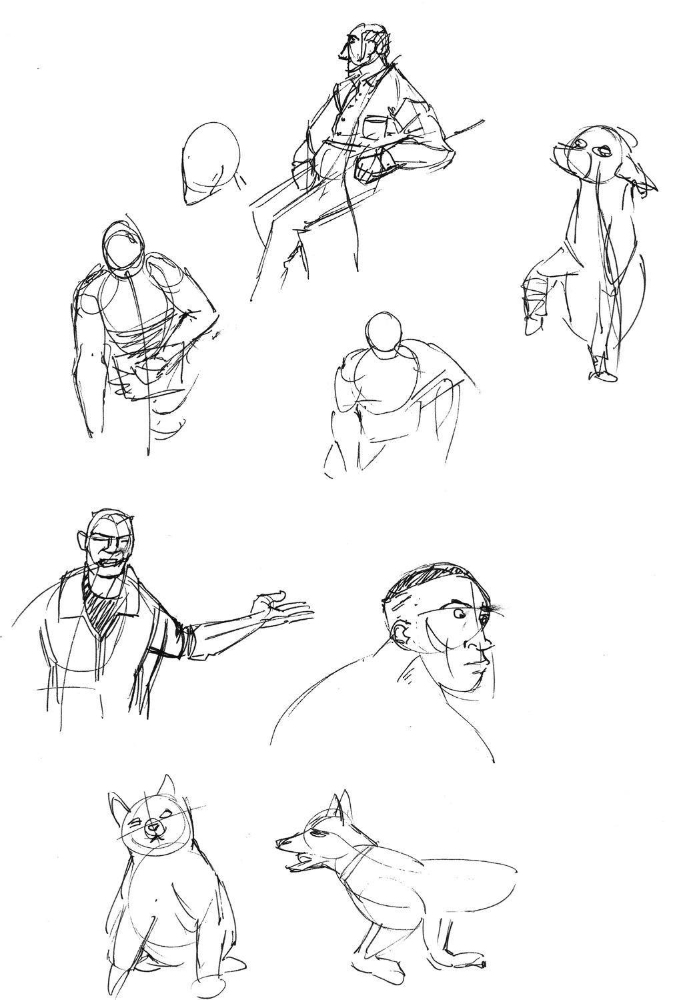
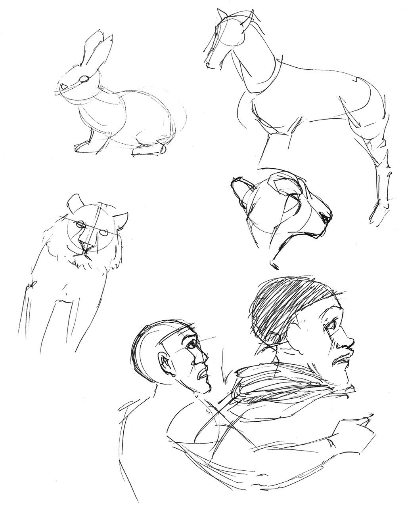
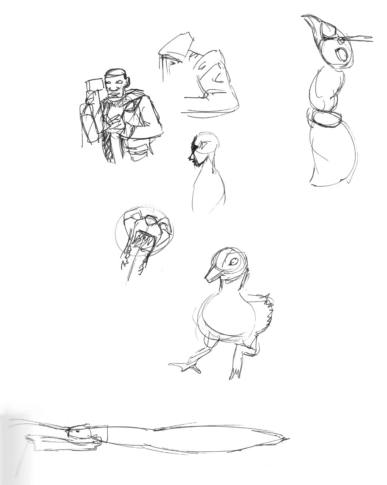
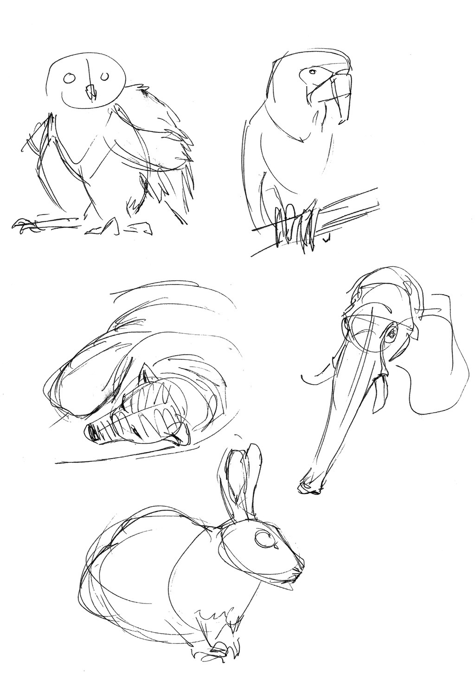
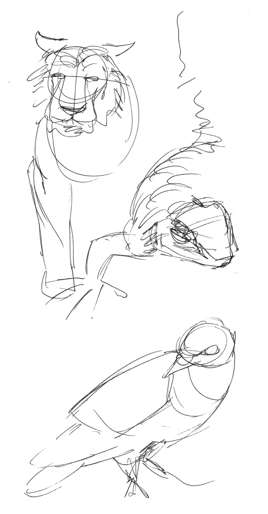
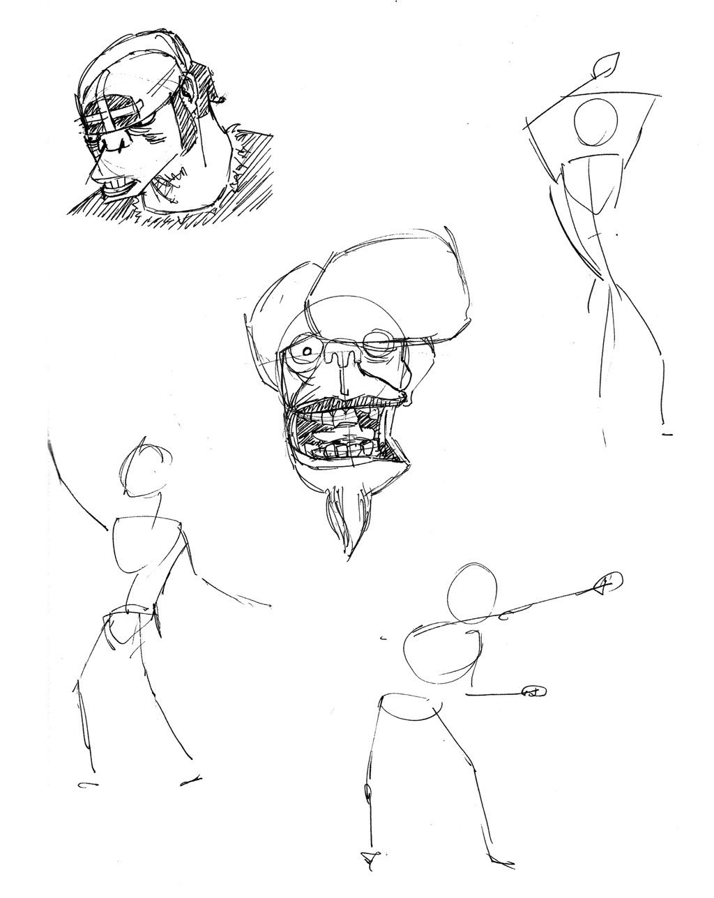
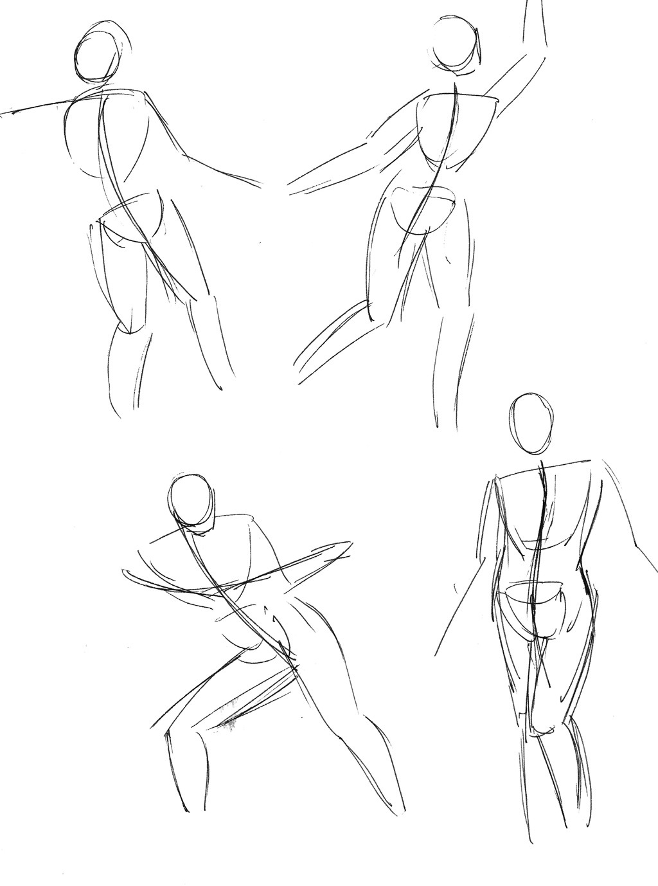
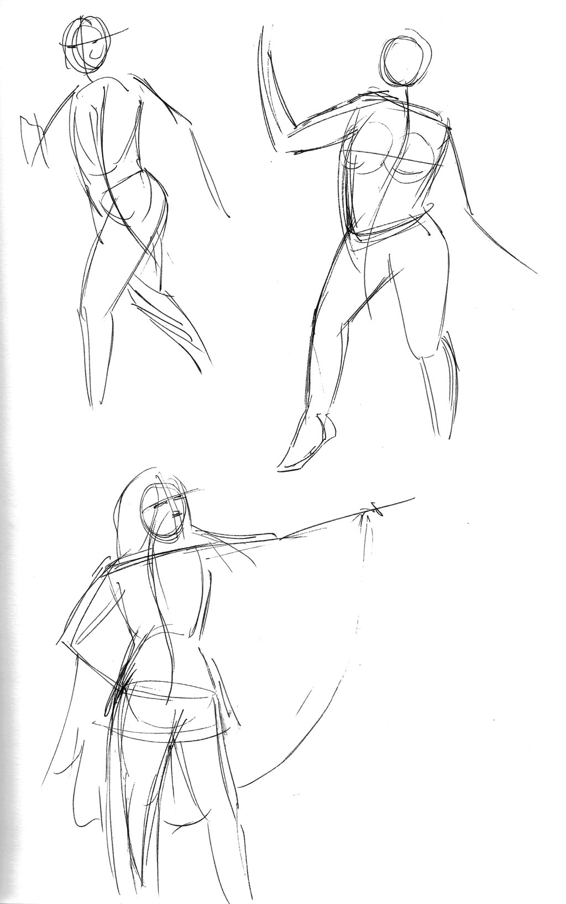

Initially I started this blog to track every. single. drawing. I did. I wanted this to be an accurate history of the work I’ve been doing to improve. Now that I’ve increased the pace a little bit, I think it’s uninteresting &amp; too much work to have multiple uploads of basic drawings. So, I will reduce the quantity of basic exercises I upload (simple line training exercises, &lt; 5 min gestures, etc.)

