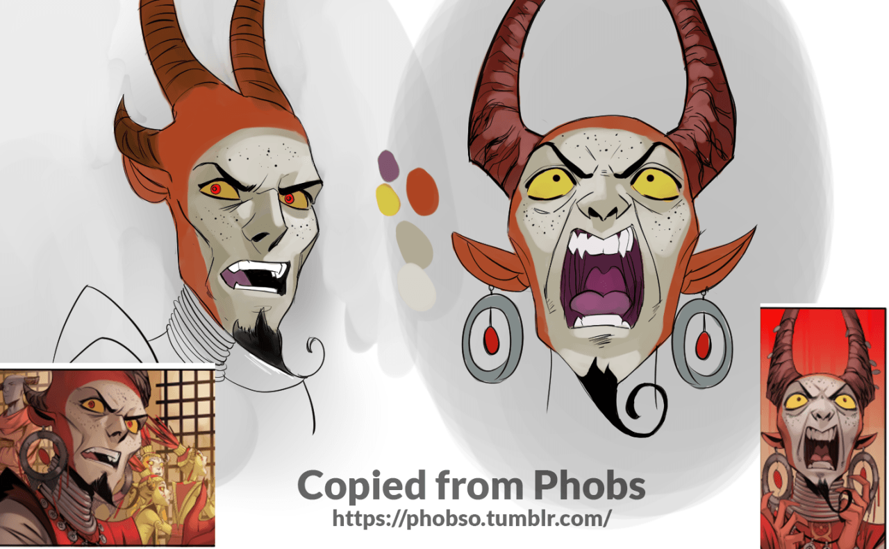
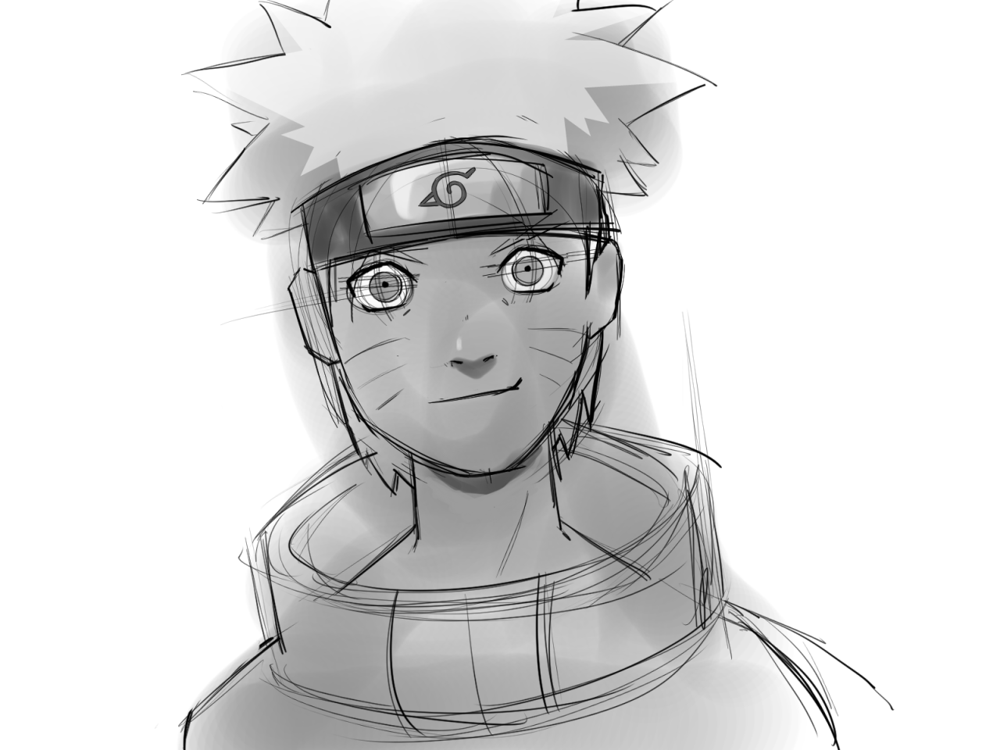

<h2>Context</h2>
I haven’t drawn in a long time and I wanted to get back into it; I feel like the quarantine is a great opportunity to focus on my goals. I also had some savings so I bought a new drawing tablet, the Wacom Cintiq 16.
<h2>My work</h2>
This was my first session in a while, so I wanted to keep it light &amp; fun

<b>Orange/Red character</b>

Original source: <a href="https://phobso.tumblr.com/">https://phobso.tumblr.com/</a>

Things to improve/learn for next time:
<ul><li>Perspective on the &frac34; view</li><li>Texturing &amp; line-work</li></ul>
<b>Naruto</b>

The Naruto drawing is copied from the series itself 

Things to improve/learn for next time:
<ul><li>The chin is not symetrical</li><li>Neck &amp; shoulders proportions &amp; anatomy</li></ul>

