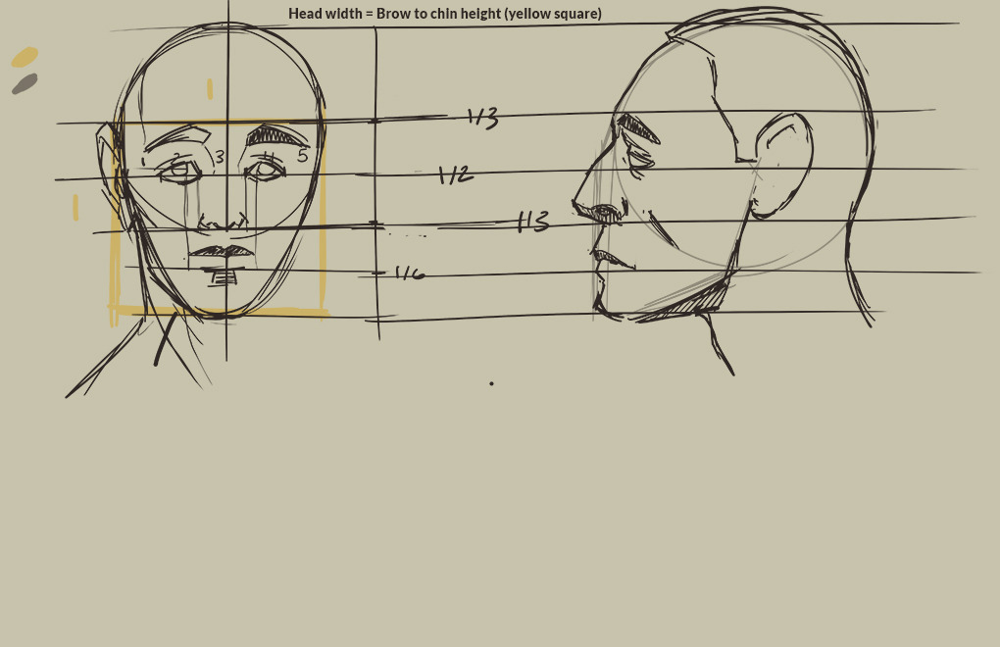
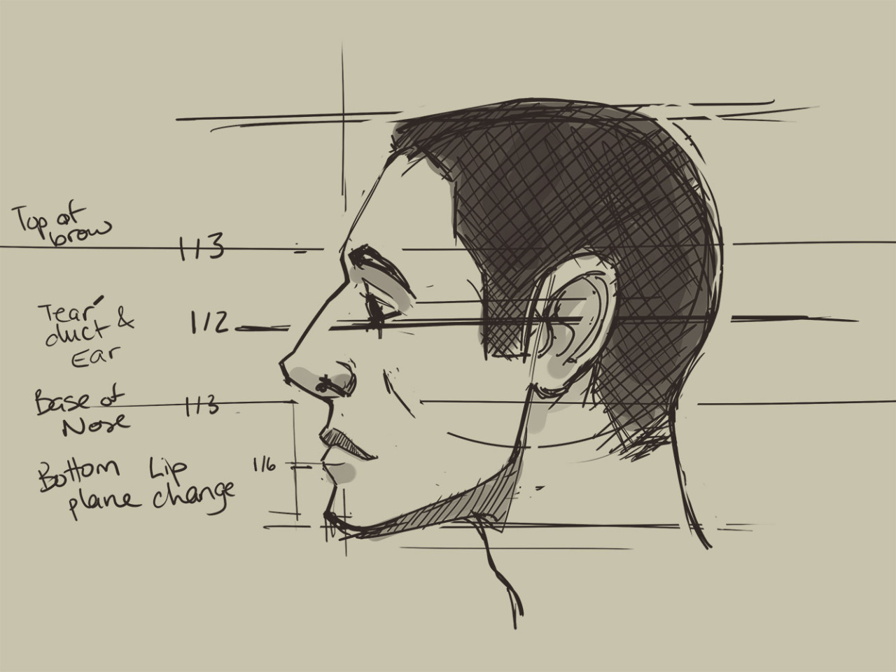
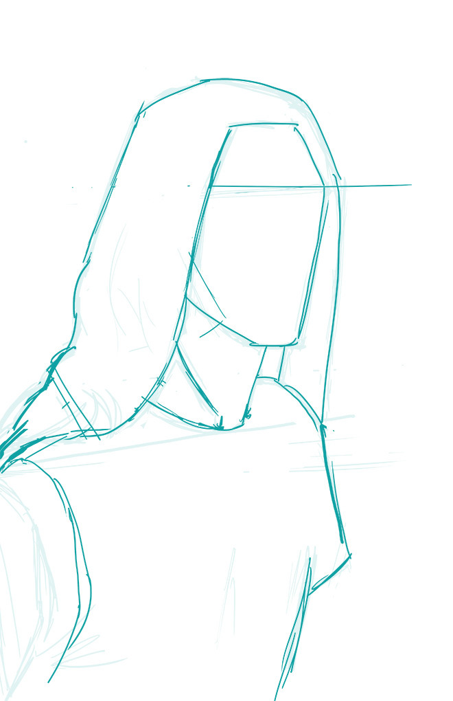
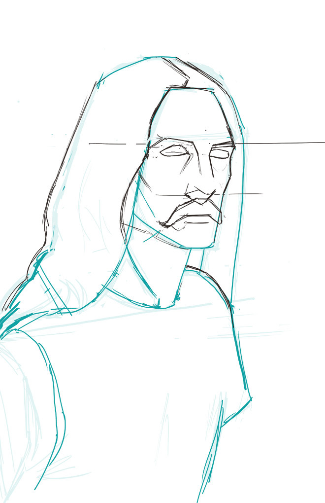

<h2>Context</h2>
These drawings are the early steps from a new online course I bought for drawing portraits, you can find it here: <a href="https://www.domestika.org/en/courses/264-realistic-portrait-with-graphite-pencil">https://www.domestika.org/en/courses/264-realistic-portrait-with-graphite-pencil</a>
<h2>My work</h2>
I followed the course for the face proportions but I didn’t like the initial results so I tried them again on the second day and I’m happier with the drawing.

While following these proportion lessons, I also worked on the portrait itself. On day 2, I noticed there was a proportion issue with the placement of the eyes and the length of the nose when compared to the original photo. Tomorrow, I will redo step 2 while being more precise &amp; careful and see if I can avoid repeating this mistake

