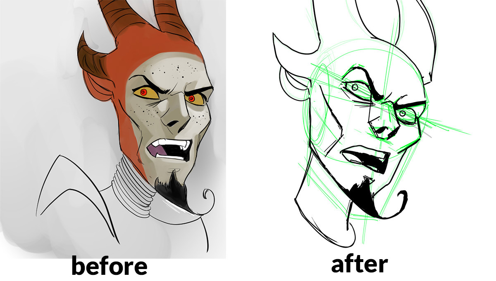
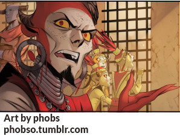

I redrew this drawing because, the last time I copied it, I really messed up the perspective.

One thing I noticed while redrawing is that I’m still rushing the general measurements phase. For example, you can see the green line for the chin &amp; jaw is way off.

