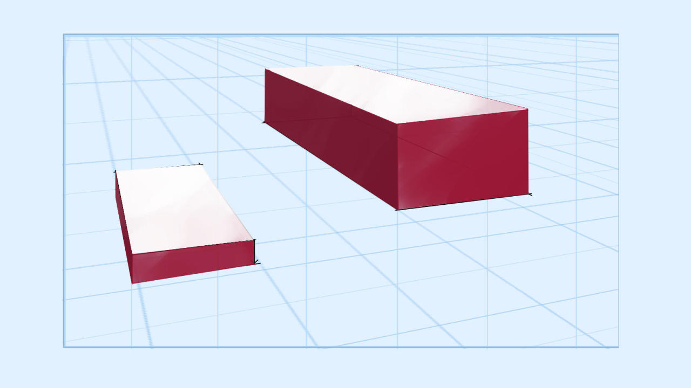
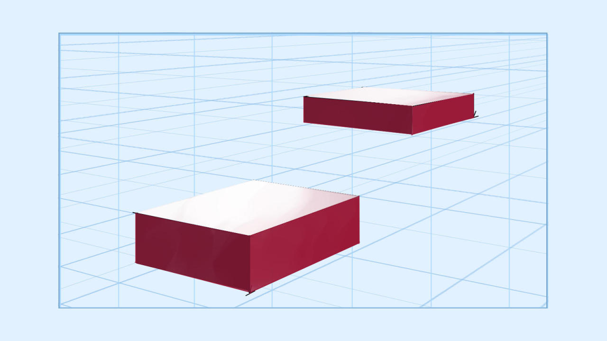
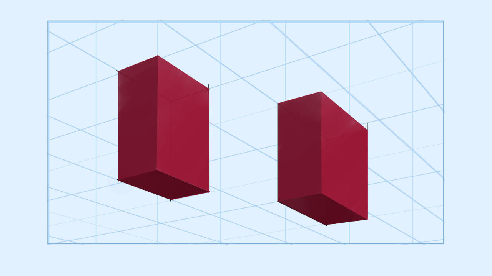
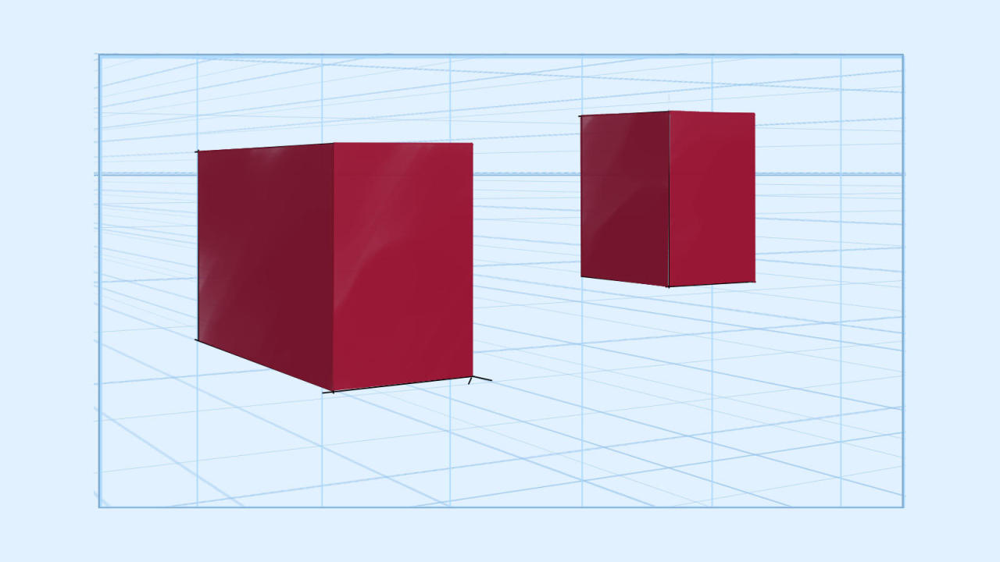
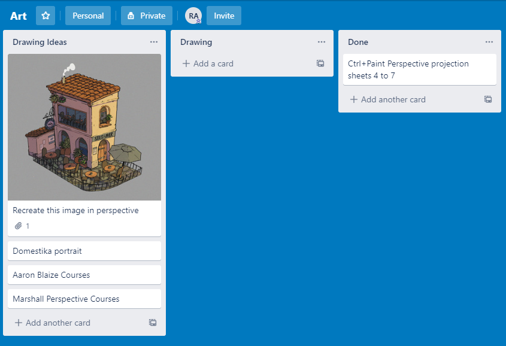

From the <a href="https://t.umblr.com/redirect?z=https%3A%2F%2Fctrlpaint.myshopify.com%2Fcollections%2Ffoundation-skills%2Fproducts%2Fperspective-sketching-1-the-basics&amp;t=ZDE1MWQ0MWExM2E0NTg2ZjZkYmYwMzFlNTQzOGQ3YTU3MjdiODk3OSx0R3ROaEVWcQ%3D%3D&amp;b=t%3AWaSiy8XC9U0NVT1-e4Qc1A&amp;p=https%3A%2F%2Fralrom.tumblr.com%2Fpost%2F619870571138809857%2Ffrom-the-perspective-sketching-1-the&amp;m=1">Perspective Sketching 1: The Basics</a> course by Ctrl+Paint

Day 2 of exercises. Today was a short session, but I stuck with my goal for the day so I am ok with that.

If past attempts are an indicator, I usually don’t follow through on day 3. So I’m reminding myself tonight before going to bed that tomorrow I will keep up this habit. In addition to that, I also am adding a small, concrete, achieveable goal that is related to my current subject of study as an incentive to keep going; my goal for tomorrow is to copy this drawing using construction &amp; perspective:

<a href="https://evaneley.tumblr.com/post/166008378178/a-corner-bistrocafe-also-using-this-for-inktober?is_related_post=1">
  https://evaneley.tumblr.com/post/166008378178/a-corner-bistrocafe-also-using-this-for-inktober?is_related_post=1
</a>

To help me stay focused and motivated, I’ve started building a Trello board with study ideas prepared in advance for days where I’m a bit lost or unmovitvated.

See you tomorrow, Robert

