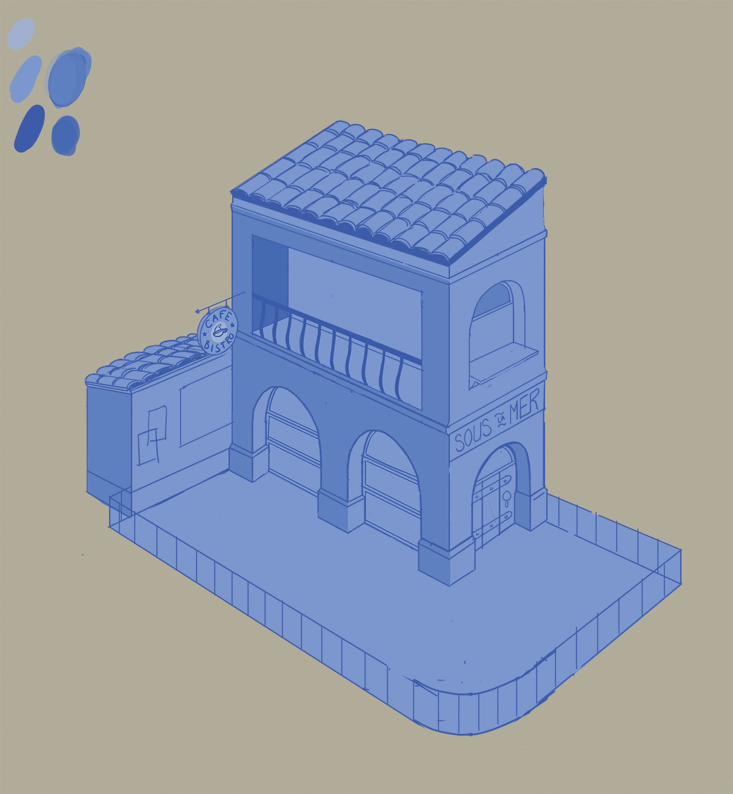
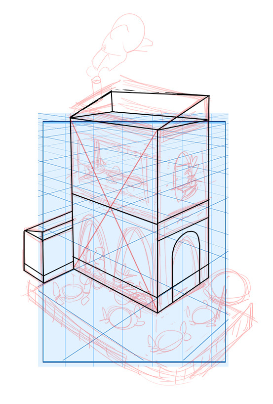
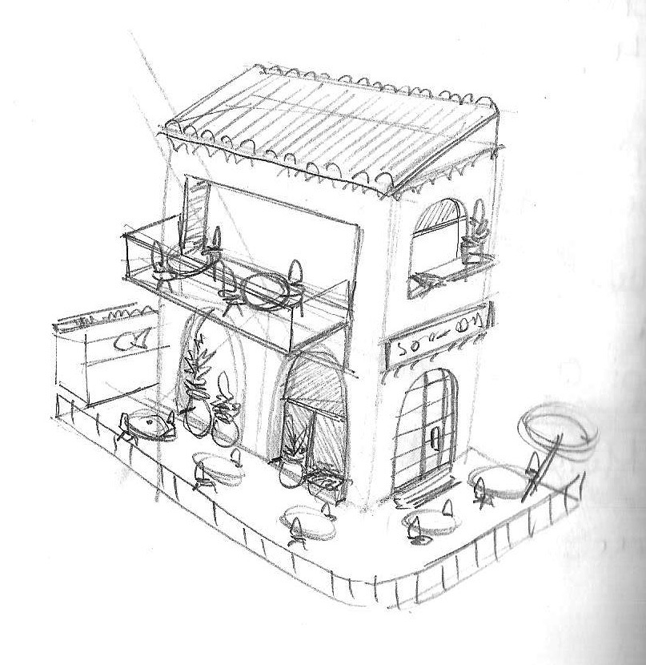
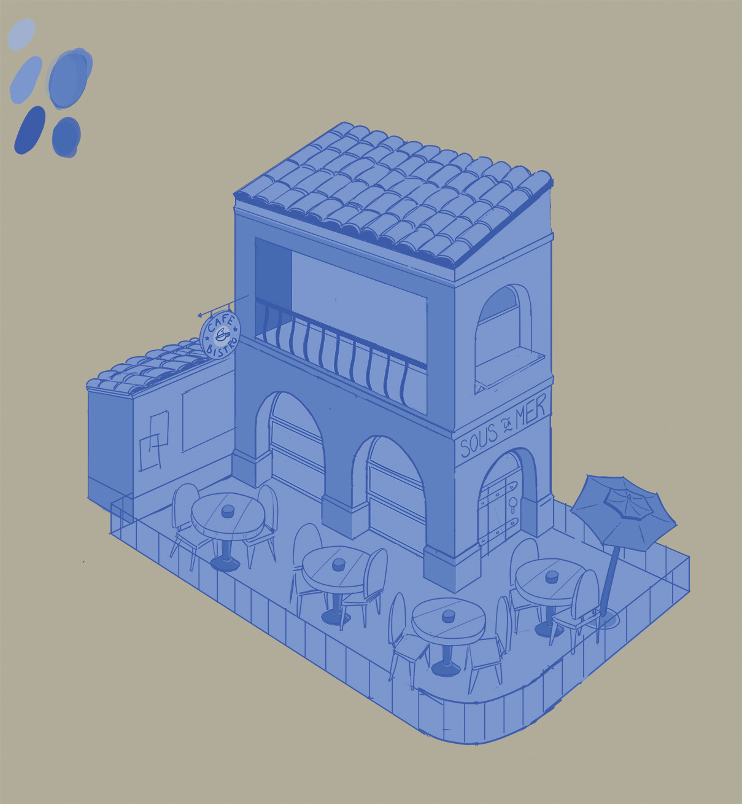

## Day 1

I attempted to reproduce [this drawing](https://evaneley.tumblr.com/post/166008378178/a-corner-bistrocafe-also-using-this-for-inktober). It took much longer than I initially thought so I had to stop my drawing here for today.{" "}

In the photos, you can see that
my first attempt (red &amp; black drawing) was too warped and it felt very rigid to me. So I decided to scrap that drawing
and start more loosely on paper. Then, I scanned my sketch and redrew it over my perspective grid, giving me a much nicer
result.

---

## Day 2

Today I didn’t spend much time on my goal. However, I did spend some time clearing tasks on my to-do list so there is
some positive.

<b>My Work:</b> I added a few more details but I’m going to move on from this piece; I got what I wanted out of the exercise.
I’ve still taken the tme to compare the drawings and notice a few mistakes to avoid for next time.

Once again, [original by Evan Eley](https://evaneley.tumblr.com/post/166008378178/a-corner-bistrocafe-also-using-this-for-inktober)

<b>How to improve next time</b>A terrible sleep last night gave me a bad day today and it affected my focus and
motivation for drawing today. Sleeping better is probably the easiest and most beneficial improvement I can make right
now.

