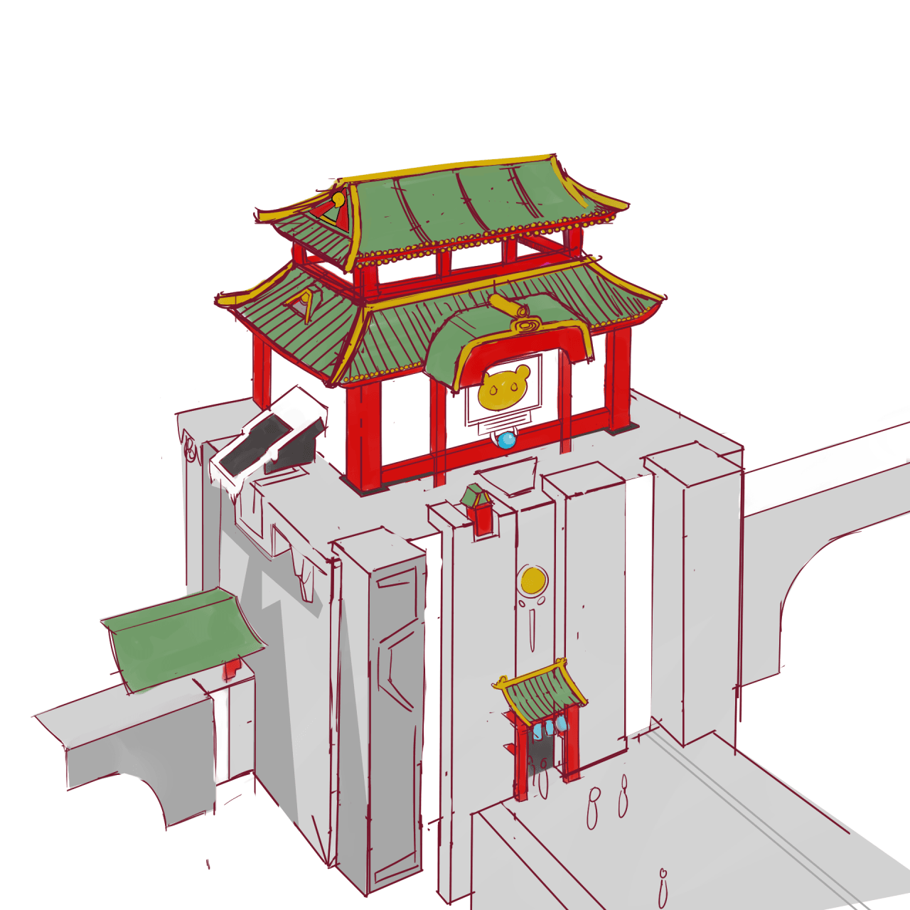
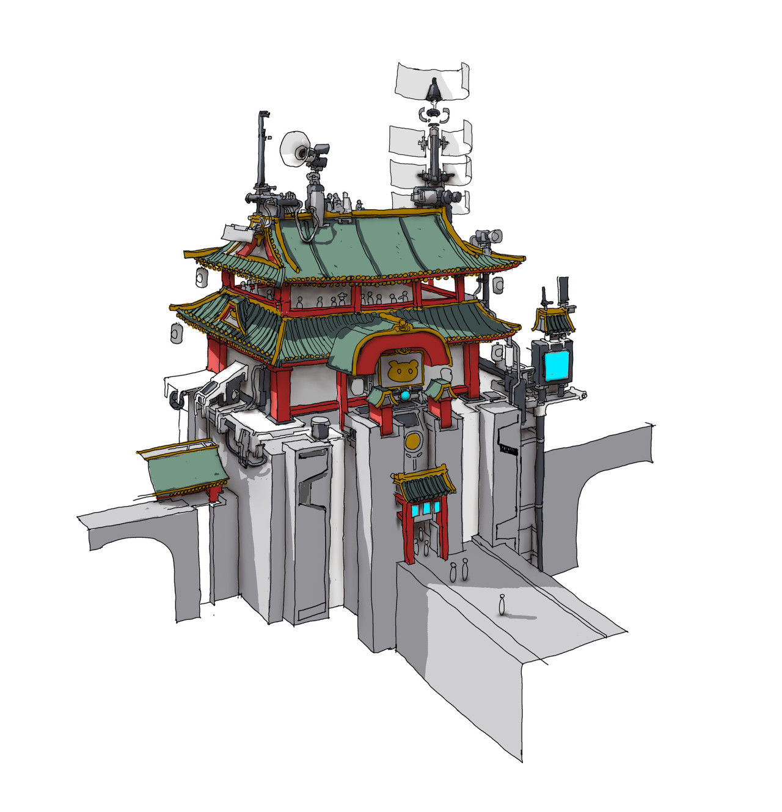

A lazy, half-assed copy of Ruan Jia’s art. I pretty much gave up trying half way through this one and just started mindlessly adding things to try to make it look interesting. But if the foundation of a drawing is flawed, no details can save it.

Tomorrow, I’m going back to drawing portraits &amp; characters to keep myself refreshed, and maybe if I have the motivation for it afterwards, I’ll retry this drawing. I’m being careful with grinding too much, because I know it can lead to burnout

