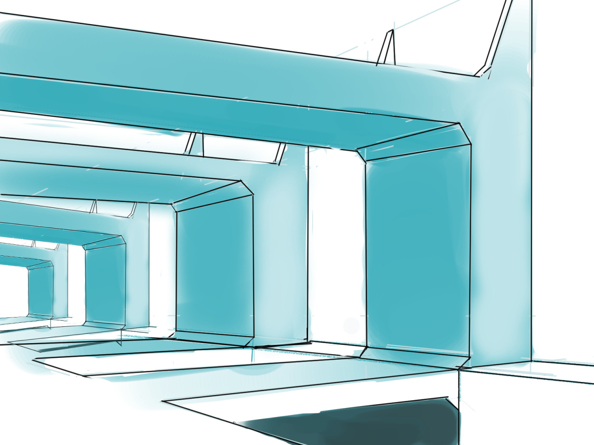

Some quick perspective sketches. I watched a lot of videos of the [Perspective Sketching course by Ctrl+Paint](https://ctrlpaint.myshopify.com/products/perspective-sketching-2-form-and-design) in the morning but then I mostly wasted the rest of the day. I wish I had continued on the great start.

I'm still working on keeping the daily drawing habit. Here's my roadmap for that, each phase will last 3-4 weeks.

**Phase 1**
Draw every day for 3 weeks (will be done by June 22nd)

**Phase 2**
Work on the consistency of the drawing sessions.

**Phase 3**
Work on the intensity of the drawing sessions

