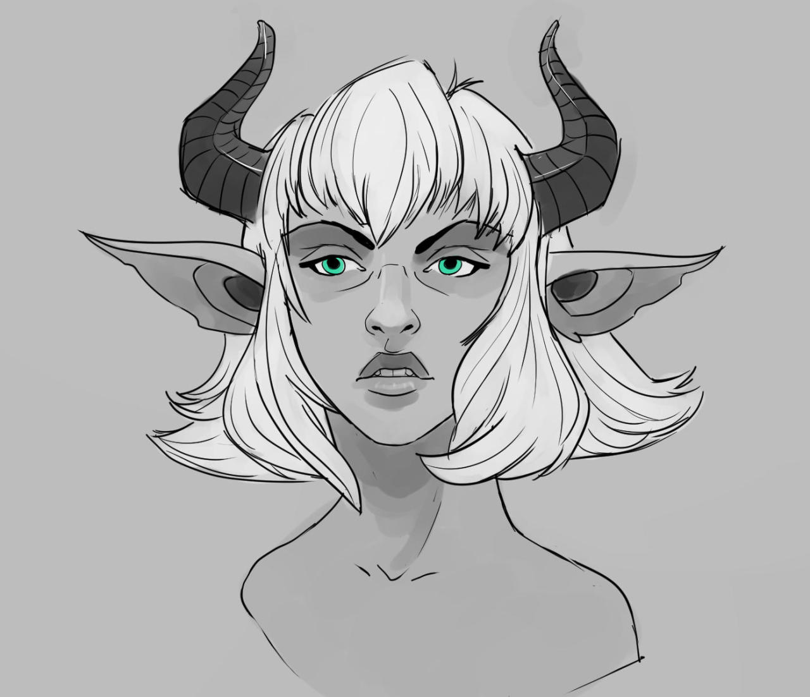

Drawing based on the one in this video <a href="https://www.youtube.com/watch?v=DrIsAiUpEXk">https://www.youtube.com/watch?v=DrIsAiUpEXk</a> 

I really have to learn neck / shoulder anatomy at this point

