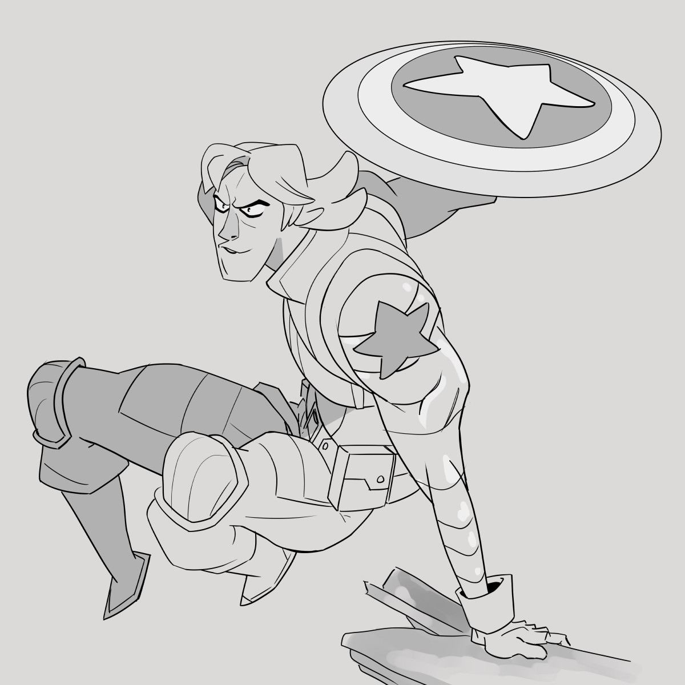
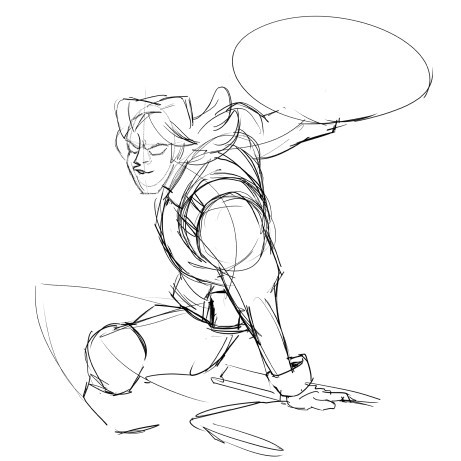

Copies of <a href="https://www.instagram.com/seangallowayart/">Sean Galloway</a>’s art

1st attempt as a quick warmup (stopped when I noticed glaring errors in the alignment)

2nd completed attempt while paying more attention to negative space and the alignment of the forms.

